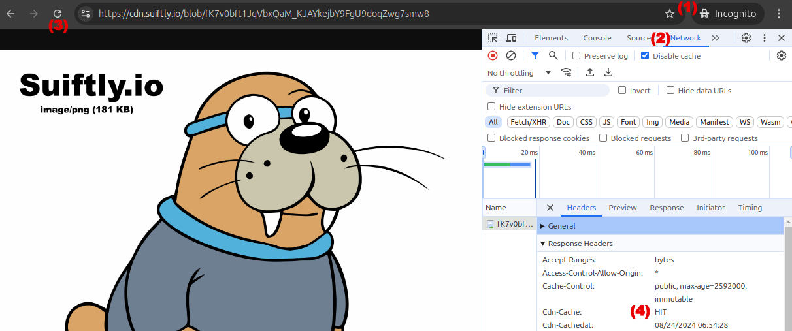

# Try It! Free. No Account Required

You can load any Blob ID with the following URL pattern:

`https://cdn.suiftly.io/blob/{Any Blob ID}`

Example image: https://cdn.suiftly.io/blob/fK7v0bft1JqVbxQaM_KJAYkejbY9FgU9doqZwg7smw8

Notes:
   - CDN response has proper Content-Type header (e.g. image/png)
   - First click is slower because the blob is being retrieved from Walrus and then cached by the CDN.
   - Blob size limited to 200 MiB (for devnet).
   - DDoS protected with 10 PoPs spread globally.

Stay tuned, this is just the first feature!

# How to measure CDN performance?
(1) Open an incognito window and the dev tools ( Ctrl-Shift-I )
(2) Select Network and "Disable Cache"
(3) Refresh to do a measurement.
(4) You can observe CDN headers

